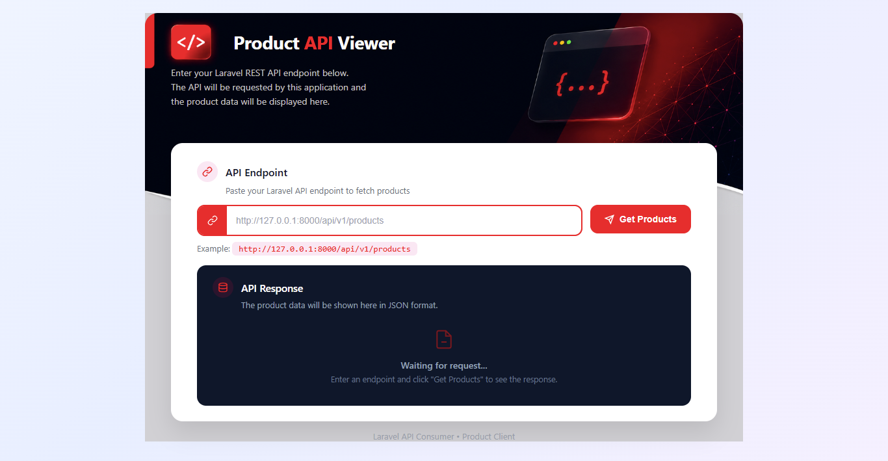
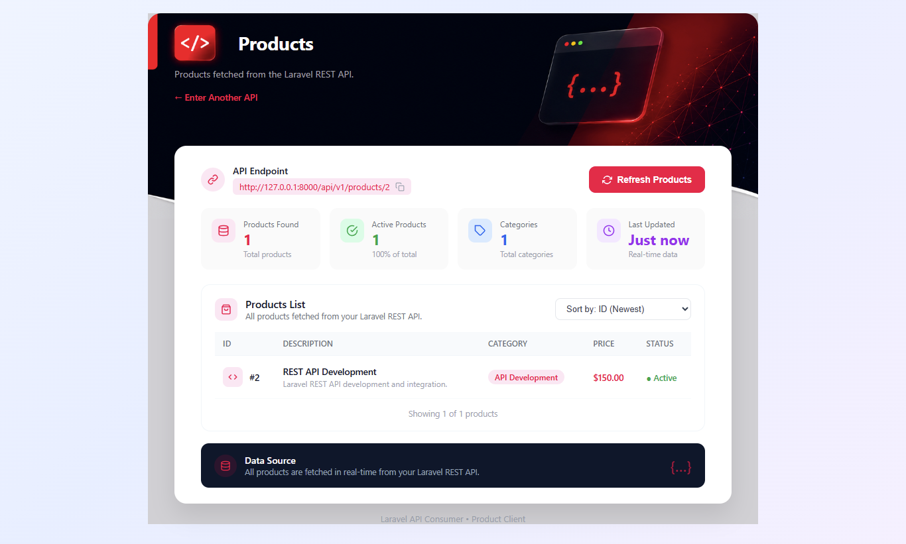

# Laravel Product API Client

A Laravel 13 client application that consumes the Laravel Product REST API and displays product data in a clean, responsive API dashboard.

This client supports both:
- Fetching **all products**
- Fetching **a single product by ID**

## Screenshots

### Product API Client Dashboard



### Product API Response



> Place both screenshots inside the `docs` folder:
>
> `docs/product-client-preview.png`
>
> `docs/product-api-response.png`

## Related Product API

This project consumes a separate Laravel REST API.

### Get All Products

```http
GET http://127.0.0.1:8000/api/v1/products
```

### Get Single Product

```http
GET http://127.0.0.1:8000/api/v1/products/{id}
```

Example:

```text
http://127.0.0.1:8000/api/v1/products/2
```

## Features

- Enter an API endpoint from the frontend
- Fetch products from a Laravel REST API
- Fetch all products
- Fetch a single product by ID
- Supports collection and single-product API responses
- Displays product ID, name, description, category, price and status
- Displays API endpoint information and product count
- Responsive API dashboard UI
- Horizontal product-card scrolling when more than four products are returned
- Laravel HTTP Client integration
- Real-time API data fetching

## Tech Stack

- Laravel 13
- PHP 8.3
- Blade
- HTML5
- CSS3
- Laravel HTTP Client
- REST API
- MySQL

## Local Setup

### 1. Clone the Repository

```bash
git clone https://github.com/MuddasirCreators/ProductAPI-Hub
cd ProductAPI Hub
```

### 2. Install Dependencies

```bash
composer install
```

### 3. Create Environment File

```bash
copy .env.example .env
```

### 4. Generate Application Key

```bash
php artisan key:generate
```

### 5. Start the Client

```bash
php artisan serve --port=8001
```

Open:

```text
http://127.0.0.1:8001
```

## Product API Requirement

The separate Product API project must be running on port `8000`.

```bash
php artisan serve --port=8000
```

API:

```text
http://127.0.0.1:8000
```

## API Endpoints

### All Products

```text
http://127.0.0.1:8000/api/v1/products
```

### Single Product

```text
http://127.0.0.1:8000/api/v1/products/1
```

## API Flow

```text
User enters API URL
        ↓
Product Client
        ↓
Laravel HTTP Client
        ↓
Product API
        ↓
JSON Response
        ↓
Products Blade View
        ↓
Products Displayed
```

## Project Architecture

```text
Product API Client
Laravel :8001
       │
       │ HTTP Request
       ↓
Product API
Laravel :8000
       │
       ↓
MySQL products table
```

## Related Project

**Product API** — Laravel REST API that provides endpoints for retrieving all products and individual products by ID.

### API Routes

```text
GET /api/v1/products
GET /api/v1/products/{id}
```

## Author

**Muddasir**

Laravel / PHP Developer
